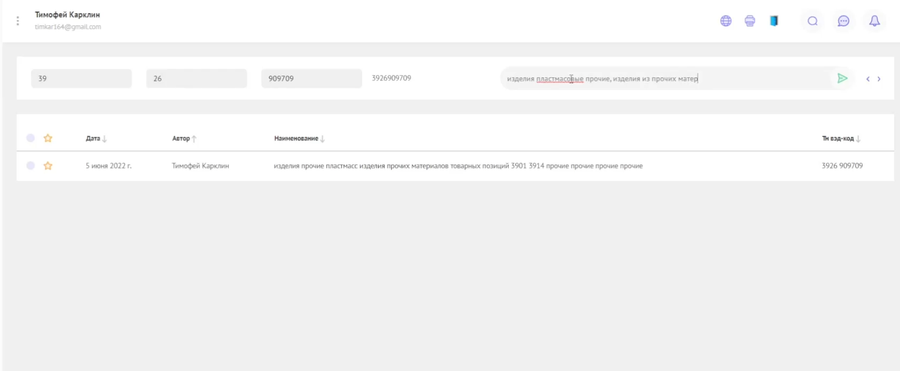
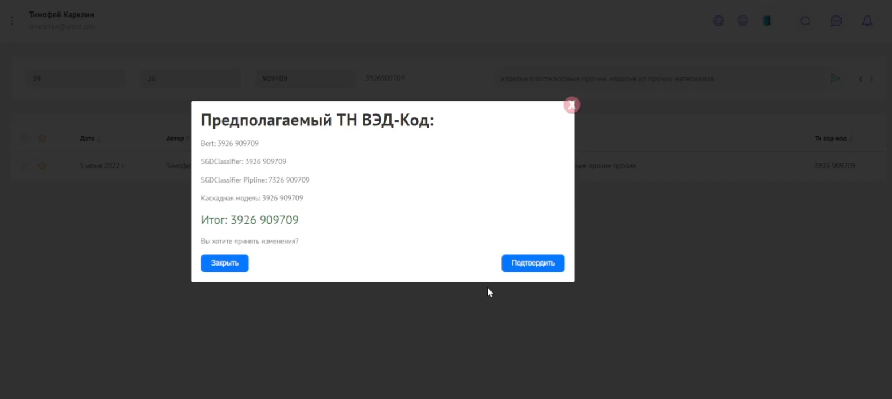
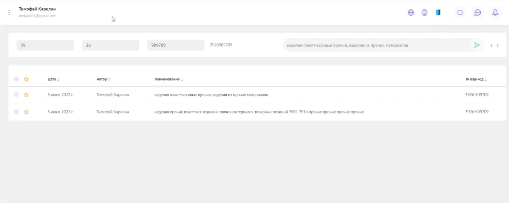

[](#) []([[https://github.com/sindresorhus/awesome](https://github.com/FenixFly/Neimark-hack-FSC/)](https://github.com/FenixFly/Neimark-hack-FSC/))
# Команда НЕЙМАРК
## Сервис для автоматического определения кода товара ТН ВЭД ЕАЭС по предложенному описанию, с возможностью дообучения на поступающих данных.

1. Вы начинаете вводить товарное описание, и быстрая модель начинает показывает быстрое предварительное предсказание
1. Порсле нажатия на кнопку со стрелочкой начинают отрабатывают все алгоритмы
1. В появившемся окне появляются предсказания всех моделей
1. Результаты предсказания складываются в базу для дальнейшего дообучения по расписанию  







## Структура

В связи со спецификой мероприятия, репозиторий содержит ряд избыточных модулей, которые не нужны при комплектации финального релиза. Для удобства навигации предлагаем следующую дорожную карту:

- директория **airflow** - содержит исходный код сервиcа дообучения молели, построенный на основе библиотеки Apache AirFlow
- директория **backend** - содержит бэкентенд сервиса, написанный на Flask
- директория **frontend** - содержит фронтенд сервиса, написанный на Node и Angular
- директория **inference** - содержит блокноты с функцией запуска предсказания для проверки корректности работы алгоритмов. *Можно без установки всей системы попробовать алгоритмы предсказания кодов ТН ВЭД*
- директория **materials** - содержит дополнительные файлы
- директория **ml_dl_models** - содержит блокноты с обучением алгоритмов классификации кодов ТН ВЭД
- **postgres.env** - содержит настройки запуска БД для сбора данных на дообучение
- **docker-compose.yml** - скрипт автоматического разворачивания системы с помощью утилиты docker-compose
- **presentation.pdf** - сорержит презентацию

Остальные файлы несут второстепенный смысл, но могут быть использованы как рабочие черновики.

## Установка

Должны быть установлены `git`, `docker`, `docker-compose`

1. Скачать репозиторий 
    ```
    git clone https://github.com/FenixFly/Neimark-hack-FSC.git
    cd Neimark-hack-FSC
    ```
1. Скачать веса обученных моделей по ссылке [https://dropmefiles.com/8BNqV](https://dropmefiles.com/8BNqV) и положить в папку *backend/models*
2. Скачать докер-образ airflow по ссылке [https://dropmefiles.com/KmyQa](https://dropmefiles.com/KmyQa) и положить в корневую папку репозитория 
3. Установить airflow из загруженного докера
    ```
    docker load < airflowdocker.tar
    ```
3. Собрать и запустить образ системы
    ```
    sudo docker-compose up
    ```
4. Система запустится автоматически. По адресу http://localhost:3000/ будет доступен веб-интерфейс системы


